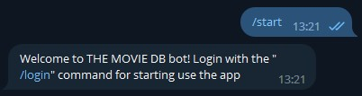
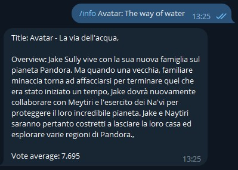
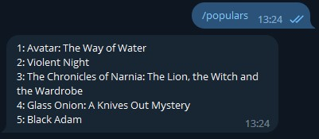
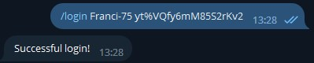
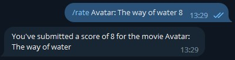
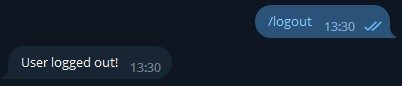

# 🎬 TheMovieBot 🎬 #

## Progetto Piattaforme Digitali per la Gestione del Territorio ##

### Studente ###
 * [Ortolani Francesco matricola n°286732](https://github.com/Franci-75)

------------------------------------------------------------------------

### Obiettivi ###
Il progetto **TheMovieBot**, si pone i seguenti obbiettivi:
1. Ottenere informazioni riguardanti un qualsiasi film
2. Ottenere i 5 film popolari del momento
3. Permettere la valutazione di un qualsiasi film

------------------------------------------------------------------------

### Componenti ###
TheMovieBot è composto da 2 parti:
- La Web API, sviluppata in **NodeJS + Express + Axios**
- Un client, bot di telegram, sviluppato in **NodeJS + Axios + Telegraf + Node-localstorage** per semplificare l'utilizzo da parte dell'utente

------------------------------------------------------------------------

## Descrizione ##

### API ###
L'API effettua richieste HTTP di tipo GET, POST e DELETE, che sfruttanno le API di TheMovieDB per adampiere gli obiettivi precedentemente citati. I dati sono forniti in formato JSON e vengono presi dal sito https://www.themoviedb.org/. 

Per raggiungere l'obiettivo **1** si effettuano 2 richieste HTTP di tipo GET:
+ la prima per ottenere l'"id" del film (necessario per la seconda richiesta)
    - https://api.themoviedb.org/3/search/movie?api_key={API_KEY}&language=it-IT&query={film_title}
+ la seconda per ottenere le effettive informazioni
    - https://api.themoviedb.org/3/movie/{id}?api_key={API_KEY}&language=it-IT
Se le richieste sono andate a buon fine, verranno restituite, in formato JSON, le informazioni del film cercato, altrimenti viene restituito un messaggio di errore.

Per raggiungere l'obiettivo **2** si effettua una semplice richiesta HTTP di tipo GET fornendo come unico parametro obbligatorio l'API_KEY.
- https://api.themoviedb.org/3/discover/movie?api_key={API_KEY}&sort_by=popularity.desc
Se la richiesta è andata a buon fine, verranno restituite, in formato JSON, i titoli dei 5 film popolari del momento, altrimenti viene restituito un messaggio di errore.

Per adempiere l'obiettivo **3** è necessario possedere ed accedere ad un account di TheMovieDB.
Vengono effettuati una serie di passaggi:
1. Il client richiede al server la creazione di un nuovo token per creare una nuova sessione, passando username e password.
- https://api.themoviedb.org/3/authentication/token/new?api_key=${API_KEY}
- https://api.themoviedb.org/3/authentication/token/validate_with_login?api_key=${API_KEY}
2. Il server riceve dal client l'username e la password. Verifica che i dati passati siano corretti (cioè che esista un effettivo account con quel username e password). Se i dati sono:
    - sbagliati: allora invio al client una risposta contenente un errore (errore: login fallito)
    - corretti: invio al client una risposta contenente un token alfanumerico
3. Se ho ricevuto il token, (quindi ho inviato uno username e una password corretta al server) il client invia nuovamente al server il token generato nel punto 2. Se ho ricevuto un token sbagliato mostro un messaggio di errore.
4. Il server riceve il token inviato dal client, lo autentica (verifica se il token sia corretto attraverso delle sue procedure interne). Se il token è corretto allora il server crea una nuova sessione e restituisce al client un id che la identifica univocamente se il token è sbagliato allora il server invia al client un mesaggio di errore (simile a quello del passaggio 2).
- https://api.themoviedb.org/3/authentication/session/new?api_key=${API_KEY}

### Bot ###

**TheMovieBot** è il client per la piattaforma. Esso permette in pochi e semplici passi di comunicare con l'API, fornendo le operazioni descritte in precedenza direttamente sullo smartphone.
Per lo sviluppo del bot telegram è stato utilizzato il pacchetto **node-localstorage** che permette un facile salvataggio delle credenziali di accesso al servizio di TheMovieDB. 
Per la messa online del servizio è stato usato Heroku sia per L'API che per il bot telegram.

------------------------------------------------------------------------

### Esempio utilizzo del servizio web ###

I comandi che il bot mette a disposizione sono i seguenti:
- */start* 
    * Dopo aver ricercato il bot telegram, chiamato "TheMovieBot", al primo avvio, o quando eseguiamo il comando, otterremo un messaggio di benvenuto.

- */info {titolo film}*
    * Fornisce informazioni generali riguardanti il titolo del film cercato.

- */populars*
    * Restituisce i 5 film popolari del momento

- */login {nome utente} {password}*
    * Esegue il login

- */rating {titolo film} {voto}*
    * Invia il voto di un qualsiasi film al sito di TheMovieDB. In caso di voto con decimali, va espresso con la virgola e non il punto.

- */logout* 
    * Esegue il logout

------------------------------------------------------------------------

### Link ###

Bot telegram:
+ https://t.me/movie_automate_bot

API:
+ https://server-pdgt.herokuapp.com/

Bot:
+ https://client-pdgt.herokuapp.com/